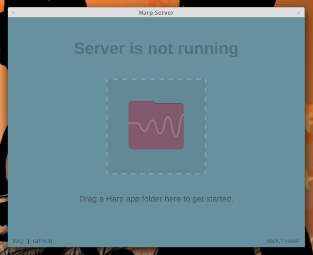
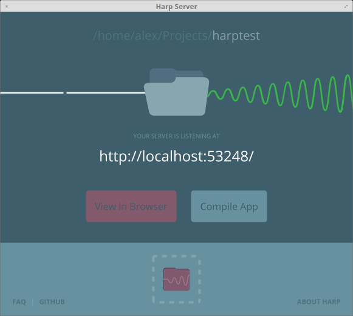

Harp GUI
========

Harp GUI is a cross-platform desktop app that lets you easily start a [Harp](http://harpjs.com/) server for local development.

Contributing
============

Harp GUI is written using web technologies and distributed with Electron. To get up and running, ensure Node.js and npm are installed (and updated to the latest version), then install Electron with:

    npm install electron-prebuilt -g

then, while inside of this project folder, run:

    npm install

to install the project dependencies. Now just run `electron .` in this directory to start the app.

License
=======

Copyright © 2015 Harp GUI Contributors

This software is licensed under GPLv3. See the `LICENSE` file for the complete license. Note that Harp is © Chloi Inc.

Other Notes
===========

Mockups provided by Teto Querini. View them [here](https://drive.google.com/folderview?id=0BwfNEizpnybJVGQ4T1UxMlIwQUU&usp=sharing).
